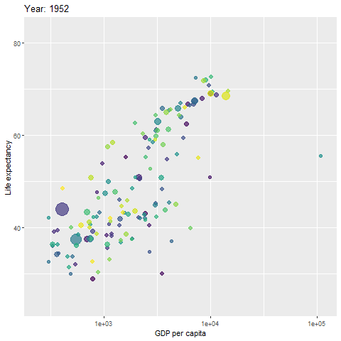

```{r animation library, message=F, warning=F, include = F}
library(tidyverse)
library(gganimate)
library(gapminder)
library(socviz)
```

```{r animation knitr, include = F}
knitr::opts_chunk$set(warning = F, message = F)
```

For animation, just need to specify the transition in the data.

Easiest transition is time.

```{r}
p <- ggplot(data = gapminder, 
            mapping = aes(x = gdpPercap, y=lifeExp, 
                          size = pop, color = country)) +
  geom_point(show.legend = FALSE, alpha = 0.7) +
  scale_color_viridis_d() +
  scale_size(range = c(2, 12)) +
  scale_x_log10() +
  labs(x = "GDP per capita", y = "Life expectancy")

g1 <- p + transition_time(year) +
  labs(title = "Year: {frame_time}")


anim_save("images/g1.gif", g1)


```

